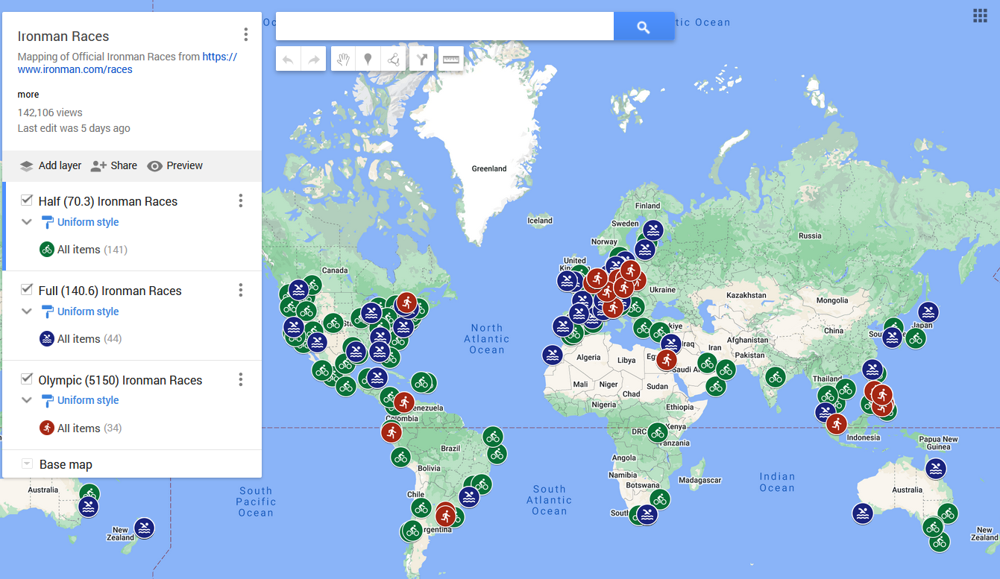

# Miscellaneous Projects

In this repo I have various projects I've worked on which don't worry a repo for themselves, but I still want to share. Details on each one are below.

If you find any of these useful and make a fork or use them, I'd love to hear about your use case!

## GarminScraper

The code in this directory is used to create this Google Sheet [here](https://docs.google.com/spreadsheets/d/11FeOS8Gf26GO9Ewp3rGzBALk9EZgT3Xian3TYOe4fwg/edit?gid=1436191853#gid=1436191853).

In essence, it scrapes garmin.com to get the details on every Garmin device made, allowing for comparison between devices and over time. I quite love Garmin products and was curious how they have evolved over time. I encourage anyone to get a Garmin, they're great!

Running the code will create an Excel file with details on every Garmin device made that is listed in the ids.

I have excluded a few files as I'm hesitant to share to much direct data in the interest of being respectful to Garmin. Namely the data used to sort the rows, the release dates, and the DCRainmaker review links. Basically anything which cannot be found by directly scraping the website. The code should work without these, it just won't be in a perfect state.

## IronmanMap

The code in this directory is used to create [this Google Map](https://www.google.com/maps/d/u/0/edit?hl=en&mid=1z3wWmoi6MFwQs9UReqbQUFVVyLWm3znH&ll=0.06307981282985509%2C0&z=2)

It scrapes ironman.com to get the details on every Ironman race and outputs a series of excel files that are then loaded into a [My Maps on Google](https://www.google.com/maps/about/mymaps/) to create a map of all the Ironman races around the world. 

I'm frankly a bit surprised there's no map on Ironman's website. If there is one created, I'd probably delete this.

## OverdriveScraper

The code in this directory is used to create [this Google Sheet](https://docs.google.com/spreadsheets/d/1SmPLWkFo2TUIUWpqPjldVeXhgQKNLHehKOTzZLFO7qY/edit?gid=1672060834#gid=1672060834), which is a scraping of every single library on [Overdrive.com](https://www.overdrive.com/), getting stats on the number of eBooks, Audiobooks, Magazines, and Videos one can check out from the library, along with the count for each category within (e.g. Fiction eBooks,  Juvenile Non-Fiction Biology eBooks, Young Adult Poetry Audiobooks etc.)

It iterates over all the possible ids of Overdrive libraries, and for all those which are valid it finds, it scrapes the website. Do note that it takes nearly a full 24 hours to run as I included quite a few sleeps in the code to be kind to Overdrive's website, and to allow the javascript to load. 

I did a brief analysis of a [run in 2023 here](https://dev.to/driscoll42/a-brief-overdrive-library-analysis-378d). The results are also used to update the [MobileRead Wiki's Libraries that offer cards online or by mail, to non-residents](https://wiki.mobileread.com/wiki/EBook_Lending_Libraries#Libraries_that_offer_cards_online_or_by_mail.2C_to_non-residents) and shared on the [MobileRead's Forum post on Non-Resident Library Cards](https://www.mobileread.com/forums/showthread.php?t=348192). I highly encourage checking both out. 
